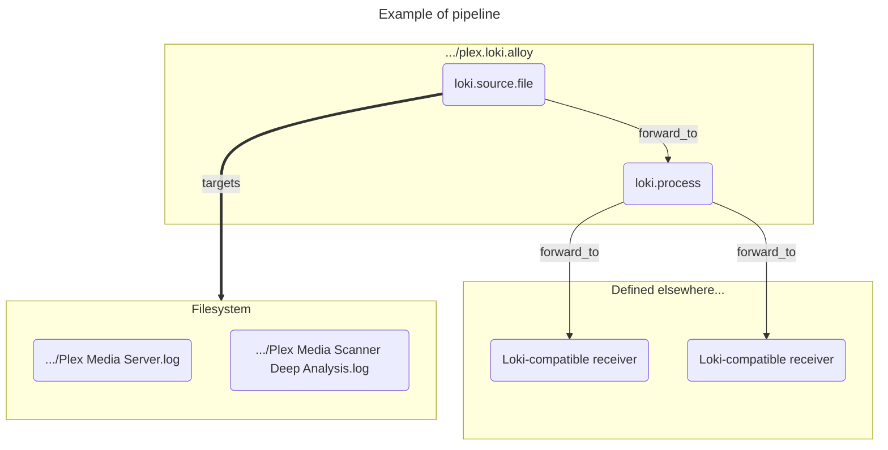

# `homelab_alloy.plex`

> [!WARNING]
> Plex Media Server is very chatty, even with debug logging disabled. Additionally, it sets logs as `WARN` or `ERROR` often, even if they have no immediate or direct impact to the user.
>
> For example, "keep alive" signals from connected clients show up as `WARN` logs because the server logs them as `Ignoring unexpected message in NotificationStream`.
>
> Because these quirks are undocumented and could therefore be changed at any moment, this role does not filter nor drop any logs. If using Grafana, I recommend using `Deduplication: Signature` on the logs so they don't get flooded with irrelevant messages.
>
## Description

This role creates `loki.source.file` and `loki.process` components that read and process Plex Media Server logs. It does so by scraping the log files from the standard Plex directory on a variable interval, as defined by `loki.source.file`'s arguments.



## Example Playbook

This is the minimal playbook required to run this role.

```yaml
- name: Run homelab_alloy
  hosts: all
  become: true
  roles:
 - role: yjohnsondev.homelab_alloy.plex
   vars:
        plex_loki_receiver_list:
          - "loki.write.default.receiver"
```

## All Variables

> [!NOTE]
> You can set the `config_name` variable to change the name of the config file itself. It will be added as "`{{ config_name }}.loki.alloy`" if provided, otherwise it will be added as "`write.loki.alloy`. **This must to be added as a variable for the role and not the play**, otherwise every subsequent role will overwrite it.

The only required variable is `plex_loki_receiver_list`, which is added to the `loki.process`'s `forward_to` argument.

```yaml
plex_loki_receiver_list:      # `list(string)`
 # Example
 # - "loki.write.default.receiver"
```

### Component labels

> [!INFO]
> Additional options for `loki.source.file` can be found in `templates/README.md`

```yaml
# Optional
plex_loki_source_file_label:  # Default: 'plex_source'
plex_loki_process_label:      # Default: 'plex_process'
```

### Labels appended to log entries

```yaml
# Optional
plex_loki_appname:       # Default: 'plexmediaserver'
plex_loki_instance:      # Default: Value of ansible_hostname
plex_loki_environment:   # Default: 'default'
plex_loki_network:       # Default: 'default'
```

### Logs

```yaml
# Optional
plex_loki_logs_dir:
# Default: '/var/lib/plexmediaserver/Library/Application Support/Plex Media Server/Logs'

plex_loki_logs:
# Default
#  - Plex Media Server
#  - Plex Tuner Service
#  - Plex Media Scanner Chapter Thumbnails
#  - Plex Media Scanner Credits
#  - Plex Media Scanner Deep Analysis
#  - Plex Media Scanner Matcher
#  - Plex Media Scanner Voice Activity
```

## Relevant Documentation

- [Plex Media Server Logs | Plex Support](https://support.plex.tv/articles/200250417-plex-media-server-log-files/)
- [Where is the Plex Media Server data directory located? | Plex Support](https://support.plex.tv/articles/202915258-where-is-the-plex-media-server-data-directory-located/)
